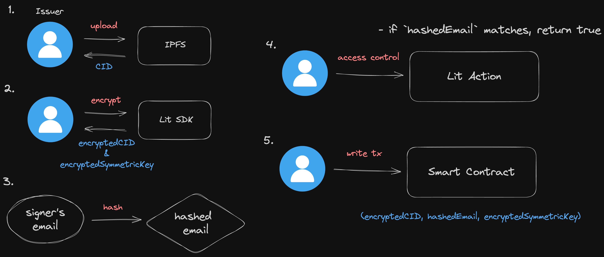
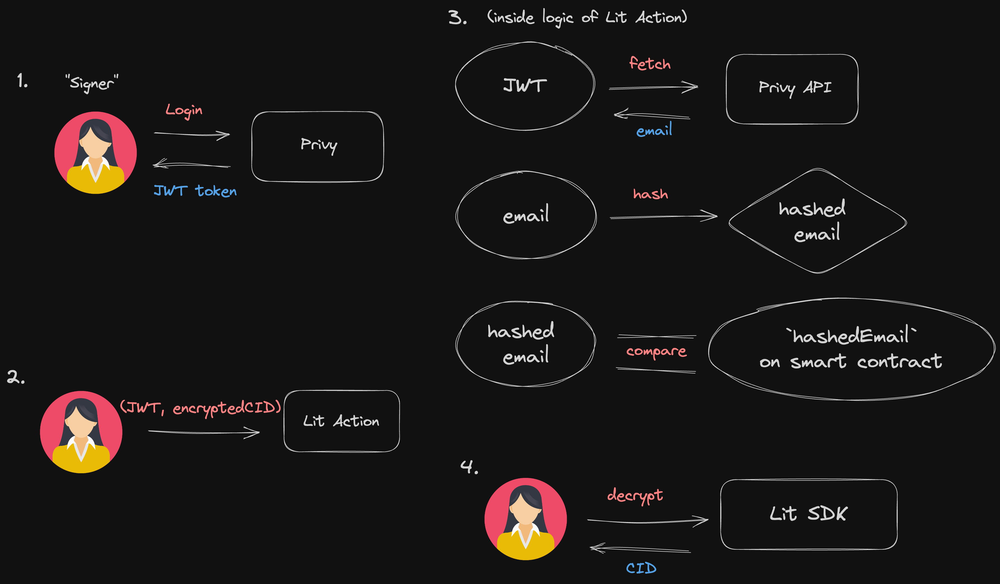
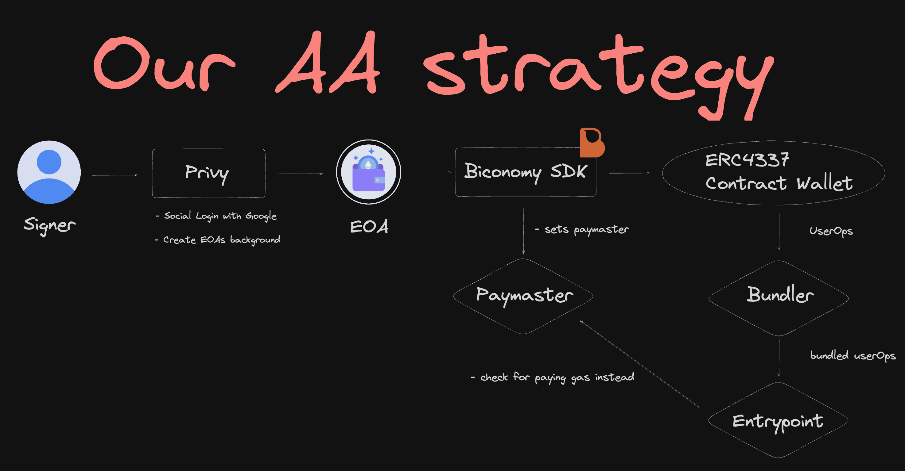
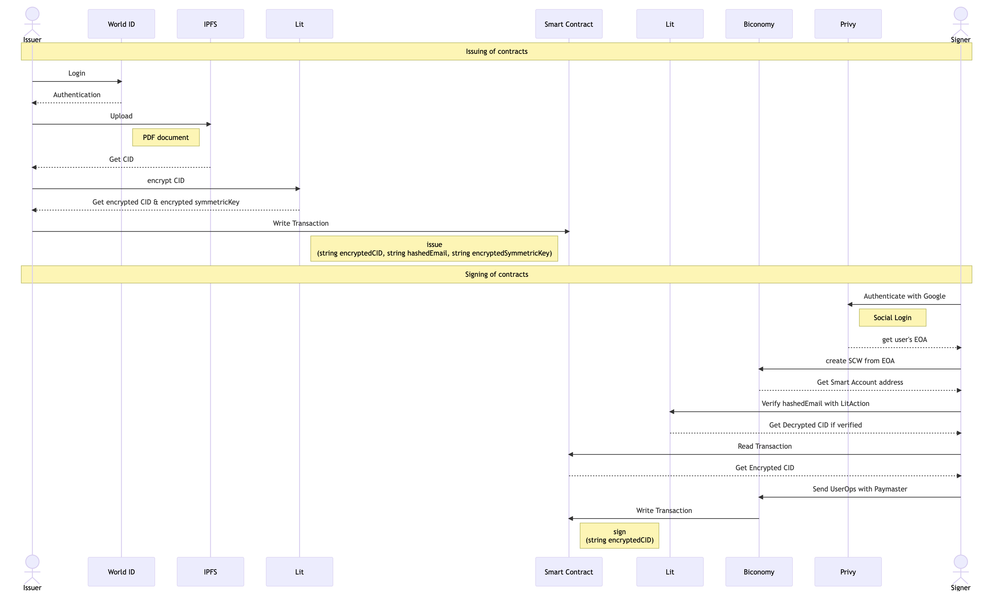

# Samurai DocuSign

A project for ETHGlobal New York 2023

**Trustless** & **UX evolved** document signing dApp!!

✨ No censorship & control by App. True P2P contract signing

🔥 Gasless signing user experience by AA and paymaster. _Signer doesn't need wallet & gas fee_

👁 Sybil Resistant by WorldID. _Only human_ can issue a legit contract document.

💎 Secure access control, encrypt & decrypt by Lit & IPFS.

🌐 Multi-chain support!

## Project Abstract

Project main goals are

- **Secure and meaningful contract signing.** Contract Issuer verifies with WorldID and upload the document to IPFS and accesss control with Lit Protocol. So only humans can issue legit contracts and peer-to-peer controls for that document.

- **Better UX for users without wallet.** The contract signer doesn't need wallet & gas fees for signing the document. Enabling social login for user and Account-Abstracted experience. Attracting Web2 users to Web3 world is very important right now!

Contract Issuer connects wallet, upload PDF contract document to IPFS and verifies he/she is a human. This means, no controls & trust for us and providing meaningful contract because only legit human can issue the document. Issuers obtain evidence that they issued secure contract on-chain by approving transactions and the state are held on smart contract.

Contract signers don't need wallet & gas fees. They only have to social login and sign the document. We verify the signer logged in with the expected email that the signer allowed. Peer-to-Peer access control for the contract document and easy UX.

### Contract address

| Chain                 | ChainId  | contract address                           |
| --------------------- | -------- | ------------------------------------------ |
| Polygon PoS Mumbai    | 80001    | 0x24c73a5C2dB4111166AE1cdf3fEe7dA8EFFf80D5 |
| Polygon zkEVM Testnet | 1442     | 0x8Dc2898e6Cc89E85f4d1E6645Cb8D1A6d88f80c7 |
| Scroll Sepolia        | 534351   | 0xc4d686f689332568953fc5640dA670a97b1F8B52 |
| Gnosis Chiado         | 10200    | 0x9795ED7a57F4A06867f06DcDc83D368583853da2 |
| Stylus Testnet        | 23011913 | 0x8Dc2898e6Cc89E85f4d1E6645Cb8D1A6d88f80c7 |

Tweet when we deployed on Gnosis: [Tweet](https://twitter.com/yokoch0/status/1705850112201596977)

### User experience flow

Issuer:

1. Connect Wallet
2. Upload the contract document(PDF)
3. Specify the signer's email
4. Verify with WorldID
5. Execute smart contract(`issueContract`)
6. Copy the URL and send it to the signer

Signer:

1. Access to the URL
2. Social Login(Google / email)
3. View the contract document
4. Sign it

## Tech Architecture

2 actors in App.

- Issuer(create a contract document)
- Signer(sign a contract issued by Issuer)

### Issuer tech flow

1. Connect wallet
2. Verify issuer is a legit human with Worldcoin
3. Specify the signer by providing the signer's email
4. Upload contract document(PDF) to IPFS
5. Encrypt the CID with Lit SDK
6. Write (encryptedCID, hashedEmail, encryptedSymmetricKey) on smart contract

### Signer tech flow

1. Social Login with Google / email
2. Create EOA with Privy
3. Create SCW(Smart Account) with Biconomy SDK
4. Verify the signer has a expected email with LitAction
5. Decrypt the `encryptedCID` and get document CID
6. View the contract document with CID
7. Sign with Gasless tx by Biconomy SDK

### How we access control?



Issuer side is pretty simple.

1. Issuer upload contract document to IPFS and get CID
2. Issuer Encrpts the CID with Lit SDK and get `encryptedCID` and `encryptedSymmetricKey`
3. Issuer hashes the signer's email provided and get `hashedEmail`
4. Issuer set Access-Control-Condition on LitAction like:

```
if this `hashedEmail` matches the signed-in user's hashedEmail, he/she has to be the signer and enable to view & sign the contract
```

5. write on smart contract (encryptedCID, hashedEmail, encryptedSymmetricKey)



Signer side is a little complicated

1. Signer signin with email / google and get JWT toekn from Privy
2. Signer passes (JWT token, `encryptedCID` \*on URL path parameter)
3. Inside of Lit Action, the code recovers user's email from JWT by PrivyAPI, hashes the email, compare if current hashedEmail matches `hashedEmail` on smart contract.
4. If Lit Action Condition return true, the signer can decrypt `encryptedCID` and recover CID.

This architecture enables trustless & secure P2P access control.

### UX optimization with AA



We optimizes UX by combining Social Login + EOA creation and Biconomy SDK v2 Smart Account.

Signers can signin with Google / Email on this app and hold EOA, this system is enabled by Privy for Authentication and EOA creation. And before user execute transactions, we provide ERC4337 wallet with paymaster by Biconomy SDK v2. Then users can execute transactions without gasfees and bad signing UX.

### System Sequence


